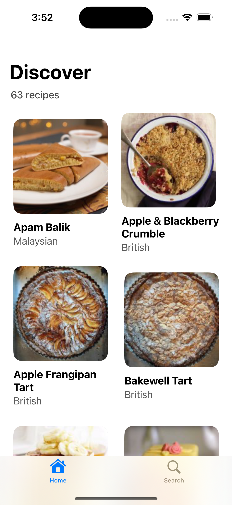
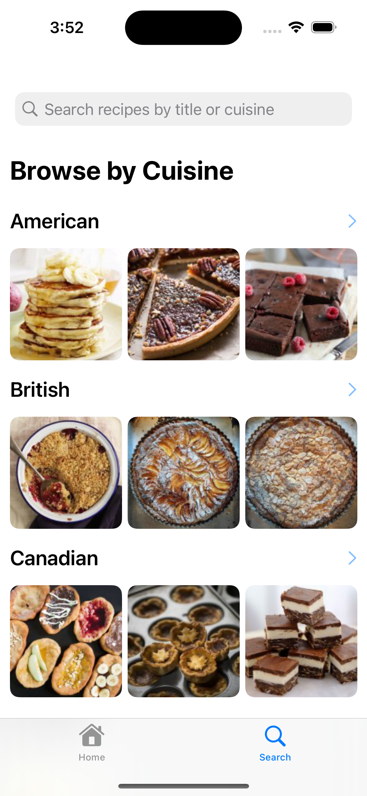

# Fetch Recipes

## Summary 
### Splash Screen


### Home



### Search



### Detailed Recipe View
.png)


## Focus Areas 
- **API Integration**: Integrating the external recipe API was a priority because it powered the core functionality of the app, which was to display recipes to users. I implemented Swift's `async/await` concurrency model, enabling efficient data fetching and responsive UI updates. I also implemented error handling and data decoding to maintain data reliability and accuracy.
- **Efficient Network Usage**: To ensure that the app could run in a simple and performant manner, I structured the code logic so that the app fetches data once on launch and avoids repeated network requests while users browse content.
- **User Experience and Interaction**: I chose to keep to a clean and intuitive layout that would allow users to easily browse through recipes by image previews, cuisine, and use the search functionality to find specific dishes. This decision was inspired with the intention that the simplicity helps users engage with the content right away without distractions. 

## Time Spent
| **Task** | **Estimated Time** |
------------------------------------------------------------------------------------------------------|----------------------|
| Set up project, review Swift and SwiftUI documentation | ~8 hours |
| Define information architecture & app flow | ~2 hours |
| UI (launch, navigation, home, error, detail view) Implementation and primary development | ~8 hours|
| Connect API endpoints & handle malformed/empty cases | ~6 hours|
| Write and run unit tests (API + caching logic) | ~8 hours |
| User testing and UX refinements | ~4 hours | 
| Final cleanup, README, and repository prep | ~2 hour |
       

## Trade-offs and Decisions
|**Decision** | **Trade-offs** |
|------------------------------------------------------------------------------------------------------|-----------------------------------------|
| I chose to focus on development for only iPhone, not the iPad, even though both devices use the iOS SDK. | Focusing only on iPhone simplifies initial development but risks increased effort later to support iPad and may limit the user experience for iPad users |
| I prioritized core recipe fetching and display features over advanced user authentication and data persistence for the initial release. | Prioritizes a quicker delivery of the main functionality but delays the full user experience with saved recipes and personalized features |
| I implemented a simple in-memory image caching system rather than integrating a third-party caching library | Reduces dependencies and keeps the app lightweight but may limit caching efficiency and features, affecting performance with large image loads |
| I used Swift Concurrency (async/await) for networking to simplify asynchronous code handling and fetch data more efficiently | Improves readability and maintainability in reference to current documentation but may limit compatibility with older iOS versions or require more effort to handle complex concurrency cases|

## Weakest Part of the Project
- **Unit Tests**: The unit testing coverage is limited due to lack of knowledge and primarily focuses on core logic. With more edge cases and UI-related tests, this would strengthen reliability.
- **Performance**: While basic image caching is implemented, there's room to optimize network handling memory management further, especially if there is a slower connection or larger datasets were to be used.
- **Accessibility**: Accessibility features are currently minimal at this stage. I have yet to fully implement support for VoiceOver, Dynamic Type scaling, and thorough accessibility labelling throughout the app.

## Additional Information
I really enjoyed creating this take-home project, and took this opportunity to have demonstrate not just my technical skills, but also my attention to user experience and maintainable code. I appreciated having the chance to take this project as a self-directed opportunity for me to dive into Swift, SwiftUI, and iOS architecture. 

Through this project, I did experience some challenges, specifically in structuring clean async network calls, constructing functional unit tests, and designing flexible decoding logic to handle potential changes in the API response. It really helped to push me to write more defensive code and to think critically about error handling.

If I had more time, I would have explored adding more features, such as favorites, offline support, and more detailed filtering. I'm also excited to iterate further on the UI/UX, possibly experimenting with animations and accessibility improvements.

This project reinforced how much I enjoy building intuitive, user-centered products, and I'm eager to bring that mindset to a collaborative team environment.

### Setup Instructions
- **Minimum deployment target**: iOS 17.5
1. Clone the repository on GitHub 
```
git@github.com:daniellatsing/fetch-recipes.git
```
2. Open the Xcode project
3. Run the app through Xcode

### Future Plans:
1. **UX/UI Optimizations**: Develop a more accessible, engaging and cohesive design by implementing a consistent theme.
2. **User-centered Features**: Allowing users to sign-in or create an account, and allowing them to view and save their recipes.
3. **Optimizing code logic**: Due to limited experience, ensuring that all code is optimized and follows Swift code standards.